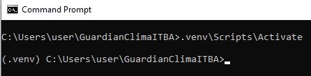

# ☀️ GuardianClimaITBA
**Grupo 121 ("")**
- Matías Barreiro
- Lautaro Cavagna
- Manuel Corsunsky Gayá
- Enzo Creatore
<!--TODO: nombre del grupo, legajos?-->

## 1. Instrucciones de instalación
- Se requiere que el sistema tenga **Python 3.10 o superior instalado**. Este programa fue probado principalmente en la última versión estable de Python, 3.14.5, y funciona perfectamente en ella.
- Se mostrarán varios comandos a ejecutar en la terminal. Tener en cuenta:
    - Los comandos deben ser ejecutados **en el directorio del proyecto** y en una terminal válida:
        - **cmd** en Windows (las instrucciones están escritas exclusivamente para cmd y no para PowerShell)
        - **zsh, bash o similar** en macOS y Linux.
    - _**importante para usuarios de macOS y Linux**: Las instrucciones muestran a los comandos de Python y pip como `python` y `pip` respectivamente. Dependiendo de su configuración, puede que tengan que cambiarlos a `python3`/`pip3` u otra variación. El comando que usen habitualmente debería estar bien siempre y cuando sea una versión de Python estándar, estable y mayor a 3.10_

### 1.1 Crear el entorno virtual
Usamos los entornos virtuales de Python (`venv`) para evitar conflictos entre los paquetes que descarga nuestra aplicación y los que ya pudieran estar instalados en el sistema.

Para crear un entorno virtual **en Windows**, ejecutar:
```cmd
python -m venv .venv
```
En **macOS y Linux es igual**, solo deben cambiar `python` por `python3` o el comando que corresponda.

Deberían ver que en el directorio del proyecto se creó un directorio `.venv`, si no lo ven, verifiquen haber ejecutado el comando correctamente.

### 1.2 Habilitar el venv
> **Importante:** Se debe realizar este paso **cada vez que se abra una terminal nueva** para utilizar la aplicación. En todo momento debería aparecer (.venv) antes de ejecutar la apliación. (Todo el resto de los pasos de esta sección son requeridos únicamente la primera vez que se abre)

En **Windows**, ejecutar:
```cmd
call .venv\Scripts\Activate
```

En **macOS y Linux**:
```bash
source .venv/bin/activate
```

En cualquier caso, deberían ver **`(.venv)`** escrito al lado del campo en el que normalmente escriben los comandos en la terminal, ej. (en Windows):


### 1.3 Instalar las dependencias
Todas las dependencias están en `requirements.txt`, en un formato que permite que pip las instale con un solo comando. En cualquier plataforma:

```bash
python -m pip install -r requirements.txt
```

Verán cómo pip descarga todas las dependencias (y sus dependencias) al venv, puede tardar un tiempo.

### 1.4 Crear `.env` con las API Keys necesarias.
El `.env` (no confundir con `.venv`) es un archivo de texto que contiene las API keys y otros datos sensibles que no deben ser subidos como parte del repositorio. Por este motivo, no aparece creado, ya que está en `.gitignore`.

Para que el programa pueda utilizar las APIs de OpenWeatherMap y Gemini, deben crear manualmente un archivo de texto y llamarlo `.env` (asegúrense de que no haya nada antes del punto ni después de `env`, el nombre completo del archivo debe ser `.env`, no `.env.txt` ni nada parecido), y en él, escriban estas dos líneas:
```dotenv
OWM_API_KEY='tu api key de OWM'
GEMINI_API_KEY='tu api key de Gemini'
```
Reemplazando `'tu api key de de OWM'` y `'tu api key de Gemini'` por sus keys reales de OpenWeatherMap y Gemin respectivamente
### 1.5 Correr la aplicación
Simplemente ejecuten en una terminal con el venv actviado:
```bash
python main.py
```
Y cualquier otro archivo requerido (ej. los CSVs solicitados vacíos), será creado automáticamente por la aplicación.